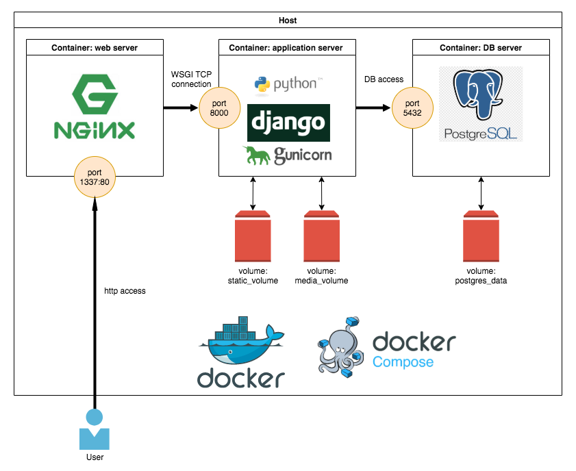
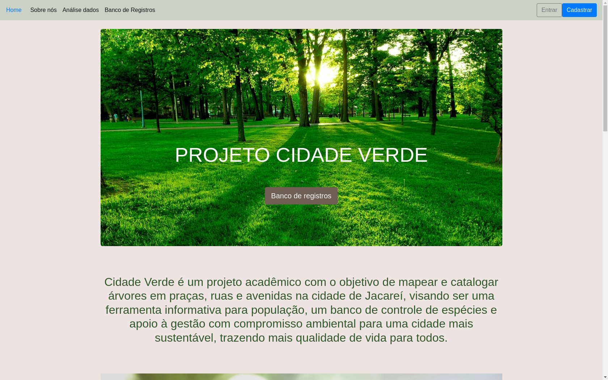

<br />

# Projeto Integrador III - Univesp - 2022

Projeto acadêmico como disciplina curricular do 6° período de 2022.

<br />

## Requisistos

O Projeto Integrador III tem como objetivo desenvolver um software com framework web ou aplicativo
que utilize banco de dados, inclua script web (Javascript), nuvem, acessibilidade, controle de versão,
integração contínua e testes. Incluir um dos seguintes requisitos: uso e fornecimento de API, análises
de dados e IoT.

<br />

## Tema proposto

Tecnologia da informação como instrumento de impacto
social e ambiental para facilitar o processo de gestão de
arborização na região proposta.

<br />

## Título

Projeto Cidade Verde

<br />

## Descrição

Criar uma página na internet (website) com o objetivo de
mapear e catalogar árvores em praças, ruas e avenidas
da cidade proposta, visando ser uma ferramenta
informativa e interativa para a população, um banco de
controle de espécies e apoio à gestão com compromisso
ambiental para uma cidade mais sustentável, trazendo
mais qualidade de vida para todos.

<br />

## Tecnologias utilizadas

### Arquitetura

```
MTV - Model Template View
Implantação microsserviços
```

### Desenvolvimento

```
Python
Framework Django
Banco de dados PostgreSQL
Bootstrap
Javascript
API de authenticação Google OAuth 2.0
API Google Maps
Docker | Docker compose
Plotly Dash
```

### Servers

```
Gurnicorn server
NGINX Server
```

### Ferramentas

```
PyCharm 
pgAdmin4
Portainer
Filezilla
SSH
```

<br />

## Implantação

### Arquitetura de implantação - microsserviços

<br />
<h3 align="center">
  
</h3><br />

### IaaS utilizada

```
Microsoft Azure
```

<br />

### VPS

```
Ubuntu 20.04 LTS
1 vCPU 1GB Ram
50 GB SSD
```

<br />

## Projeto

<br />
<h3 align="center">
  
</h3>

## License

[MIT](https://choosealicense.com/licenses/mit/)
